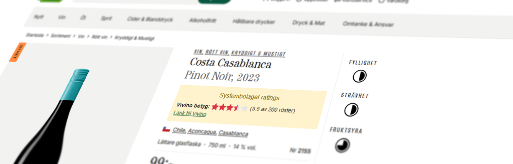

# Bolaget+

A browser plugin for Systembolaget.se that shows ratings directly at systembolagets website!



Systembolaget Ratings is a browser extension that provides ratings for products available on the Systembolaget website. The extension fetches ratings from [Vivino](https://www.vivino.com/) for wines and [Untappd](https://www.vivino.com/) for beers, displaying them directly on the product pages.

## Installation

[](https://addons.mozilla.org/firefox/addon/bolaget-plus) [](https://chromewebstore.google.com/detail/bolaget-plus/bbjfkhmnofhindccdlfmhkibfafiogao)

Or download the latest zip from the [Github Releases](https://github.com/BroadcastDivers/bolaget-plus/releases) page and install it in your browser.

## Usage

1. Install the extension from the Firefox Add-ons or Chrome Web Store.
2. Navigate to the Systembolaget website.
3. Browse products as usual. Ratings will be displayed on the product pages.
4. Use the extension popup to:
   - Disable wine ratings.
   - Disable beer ratings.
   - Disable the extension entirely.

## Contributing

This project is using the [wxt framework](https://wxt.dev/).

Install dependencies with [pnpm](https://pnpm.io/)

```sh
pnpm install
# Git hooks will be automatically installed
```

Run it in either Chrome or Firefox:

```sh
pnpm dev:firefox
pnpm dev:chrome
```

## Publish

```sh
pnpm install
```

Publish to either Chrome or Firefox:

```sh
pnpm zip:chrome
pnpm zip:firefox
```

The output is located in the `.output` folder.

---

This extension is using the WXT framework. Read more about [WXT](https://wxt.dev/guide/essentials/project-structure) here.
