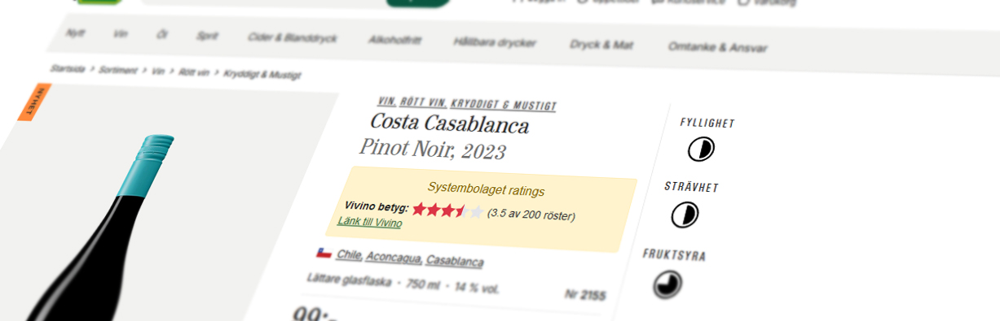

# Bolaget+

[]() [](https://github.com/BroadcastDivers/bolaget-plus/actions/workflows/ci.yaml)

A browser plugin for Systembolaget.se that shows ratings directly at systembolagets website!



## Features

- Seamless integration with Systembolaget's website
- Wine ratings from [Vivino](https://www.vivino.com/) with direct links to product pages
- Beer ratings from [Untappd](https://untappd.com/) with direct links to product pages
- Cider & mixed drink ratings from [Untappd](https://untappd.com/) with direct links to product pages
- Rating badges on product cards in the assortment list pages
- Label thumbnails with hover zoom, and "closest match" suggestions when no confident match is found
- Easy toggling of features through a simple popup interface
- Works with both Firefox and Chrome browsers

## Installation

[](https://addons.mozilla.org/firefox/addon/bolaget-plus) [](https://chromewebstore.google.com/detail/bolaget-plus/bbjfkhmnofhindccdlfmhkibfafiogao)

Or download the latest zip from the [Github Releases](https://github.com/BroadcastDivers/bolaget-plus/releases) page and install it in your browser.

## Usage

1. Install the extension from the Firefox Add-ons or Chrome Web Store.
2. Navigate to the Systembolaget website.
3. Browse products as usual. Ratings will be displayed on the product pages.
4. Use the extension popup to:
   - Disable wine ratings.
   - Disable beer ratings.
   - Disable cider & mixed drink ratings.
   - Disable the extension entirely.

## Development

Install dependencies with [pnpm](https://pnpm.io/)

```sh
pnpm install
# Git hooks will be automatically installed
```

Run it in either Chrome or Firefox:

```sh
pnpm dev:firefox
pnpm dev:chrome
```

### Testing

Run the checks CI gates on (fast, no network):

```sh
pnpm test:unit       # vitest unit tests
pnpm test:matching   # mocked-fetch Vivino/Untappd matching regressions
```

Run the smoke tests (builds the extension, then drives it against the live
Systembolaget/Vivino/Untappd sites with Playwright). These depend on those
sites' current markup and availability, so they are expected to be flaky and
run nightly rather than on every push:

```sh
pnpm test:smoke
```

### Building

Build the extension locally:

```sh
pnpm build:chrome   # or build:firefox
```

The output is located in the `.output` folder.

## License

This project is licensed under the [MIT License](LICENSE) - see the LICENSE file for details.

## Framework

This extension is built using the WXT framework. Learn more about [WXT](https://wxt.dev/guide/essentials/project-structure) here.
